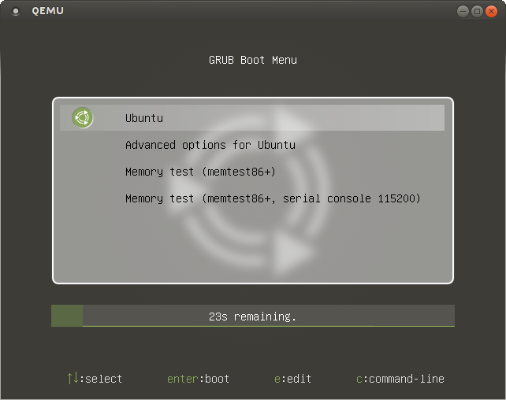

grub2-themes-ubuntu-mate
========================


Except where otherwise **noted**, content of grub2-themes-ubuntu-mate by Ivan Pejić aka nadrimajstor is licensed under a [Creative Commons Attribution-ShareAlike 4.0 International License](http://creativecommons.org/licenses/by-sa/4.0/)
***



###Debian package install
```bash
sudo apt-get update && sudo apt-get -y install git devscripts debhelper
git clone https://github.com/nadrimajstor/grub2-themes-ubuntu-mate
cd grub2-themes-ubuntu-mate
debuild
dpkg --install ../grub2-themes-ubuntu-mate_0.1_all.deb
```

####Manual install
1. Copy .PNGs and theme.txt files to `/boot/grub/themes/ubuntu-mate`
2. Add to grub's menu.cfg `theme=/boot/grub/themes/ubuntu-mate/theme.txt` or patch `/lib/plymouth/themes/default.grub`

####Ubuntu-mate specific patch for `/lib/plymouth/themes/default.grub`
```diff
@@ -1,3 +1,10 @@
-if background_color 44,0,30; then
+if background_color 60,59,55; then
   clear
 fi
+
+color_normal=light-gray/black
+
+if [ -e /boot/grub/themes/ubuntu-mate/theme.txt ]; then
+  insmod png
+  theme=/boot/grub/themes/ubuntu-mate/theme.txt
+fi
```


